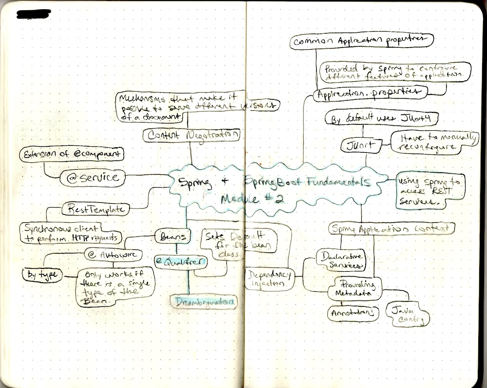

# Spring/SpringBoot Fundamentals - Module 2

## Using Spring to Access REST Services

* Spring Application Context
* RestTemplate Class
* Mapping the JSON response
* Accessing a Simple, Public interface
* Testing the REST Client
* Google Geocoder API, case study
* Application Properties, fixing JSON mappings

